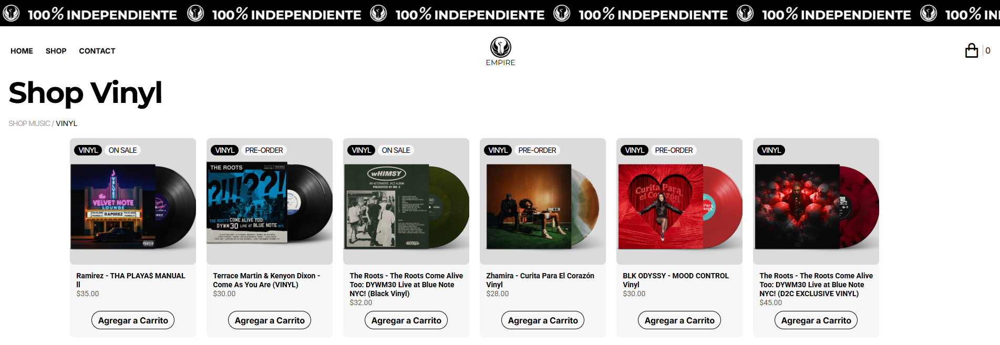
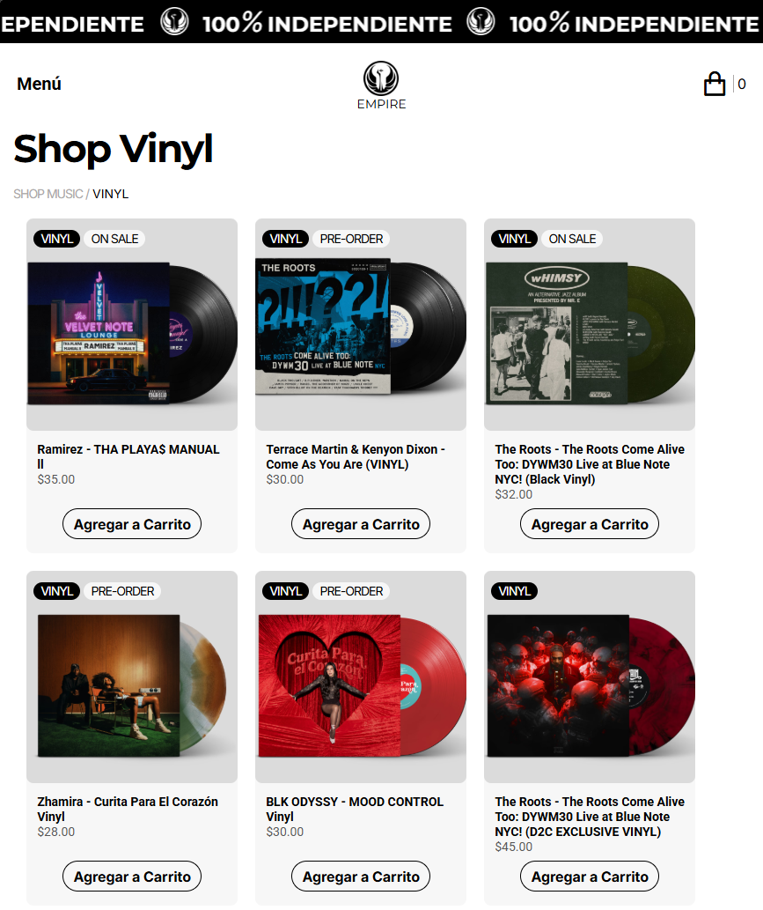
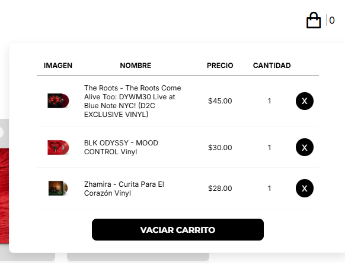

# CarritoCompra · Shop Vinyl

Tienda de vinilos **100% frontend**: catálogo responsive, carrito interactivo y persistencia en el navegador. Proyecto pensado para **demostrar prácticas de desarrollo web** (HTML semántico, CSS avanzado, JavaScript modular y buenas prácticas de accesibilidad).

## Demo en vivo (Netlify)

| Campo | Valor |
|--------|--------|
| **URL del proyecto** | [[https://carritocompraspract.netlify.app](https://carritocompraspract.netlify.app/) |

---

## Capturas

| Catálogo (escritorio, menú horizontal) | Catálogo (móvil) | Panel del carrito |
|:---:|:---:|:---:|
|  |  |  |

---

## Tabla de contenidos

- [Descripción](#descripción)
- [Demo en vivo (Netlify)](#demo-en-vivo-netlify)
- [Capturas](#capturas)
- [Funcionalidades](#funcionalidades)
- [Stack tecnológico](#stack-tecnológico)
- [Estructura del proyecto](#estructura-del-proyecto)
- [Cómo ejecutarlo](#cómo-ejecutarlo)
- [Qué se practica en este proyecto](#qué-se-practica-en-este-proyecto)
- [Créditos](#créditos)

---

## Descripción

**CarritoCompra** simula una tienda online de vinilos bajo la marca *Empire / Independiente*. No hay backend ni pasarela de pago: el foco está en la **experiencia de usuario**, el **layout adaptable** y la **lógica del carrito** en el cliente.

El catálogo combina una tarjeta de producto definida en `index.html` con artículos adicionales generados desde `info.json`, cargados de forma asíncrona con `fetch`.

---

## Funcionalidades

| Área | Detalle |
|------|---------|
| **Catálogo** | Grid de tarjetas con imagen, nombre, precio y etiquetas de estado (por ejemplo PRE-ORDER, ON SALE) cuando aplica |
| **Carrito** | Añadir productos, eliminar líneas, vaciar carrito; cálculo de total en la lógica del cliente |
| **Persistencia** | Estado del carrito guardado en `localStorage` para sobrevivir recargas de página |
| **Navegación** | Menú adaptable: panel deslizante en móvil y barra horizontal en escritorio |
| **Banner** | Marquesina animada con logos clonados vía DOM |
| **Panel del carrito** | Apertura/cierre con animaciones; en escritorio se comporta como panel flotante; clic fuera para cerrar |
| **Accesibilidad** | Roles ARIA en menú y carrito, `aria-expanded`, `aria-live`, soporte de teclado (Enter/Espacio) en controles interactivos |
| **SEO básico** | Meta descripción, `robots`, `keywords` y `lang="es"` |

---

## Stack tecnológico

- **HTML5** — Estructura semántica (`header`, `main`, `nav`, `footer`, `article`, tablas en el carrito)
- **CSS3 / SCSS** — Variables, anidación, `@keyframes`, `clamp()` para tipografía fluida, Grid y Flexbox, media queries (móvil / tablet / desktop)
- **JavaScript (ES modules)** — `import` / `export`, `async/await` con `fetch`, manipulación del DOM, delegación de eventos
- **Fuentes** — [Google Fonts](https://fonts.google.com/) (Inter, Montserrat, Roboto)
- **Iconos** — [Remix Icon](https://remixicon.com/) vía CDN

Los estilos fuente viven en `src/assets/scss/`; el navegador consume la hoja compilada en `src/assets/css/main.css`.

---

## Estructura del proyecto

```text
CarritoCompra/
├── index.html                 # Punto de entrada, layout y carrito en el DOM
├── README.md
├── src/
│   └── assets/
│       ├── css/               # CSS compilado (+ mapas)
│       ├── scss/              # Fuentes, variables y estilos principales
│       ├── js/
│       │   ├── main.js        # Orquestación al DOMContentLoaded
│       │   ├── constructor.js # fetch del JSON y creación de tarjetas
│       │   ├── carrito.js     # Lógica del carrito y localStorage
│       │   ├── animaciones.js # Banner, toggle menú y toggle carrito
│       │   └── info.json      # Datos de productos
│       └── img/               # Logos, vinilos y capturas del README
│           └── capturas/      # Imágenes para este README
└── .gitignore
```

---

## Cómo ejecutarlo

Este sitio usa **módulos ES** y rutas a recursos (`fetch` al JSON, hojas de estilo). Para evitar problemas de CORS o de rutas al abrir el archivo directamente, conviene servir la carpeta del proyecto con un servidor HTTP local.

**Opción A — VS Code / Cursor**  
Extensión tipo *Live Server*: abrir `index.html` con “Open with Live Server”.

**Opción B — Node (npx)**  
Desde la raíz del repositorio:

```bash
npx --yes serve .
```

Luego entra a la URL que indique la terminal (por ejemplo `http://localhost:3000`).

**Si editas los `.scss`**  
Recompila a CSS con tu herramienta habitual (por ejemplo `sass src/assets/scss/main.scss src/assets/css/main.css`) para que los cambios se reflejen en `main.css`.

---

## Qué se practica en este proyecto

- **Arquitectura frontend modular** — Separación por responsabilidades: datos (`constructor.js`), estado del carrito (`carrito.js`), UI animada y toggles (`animaciones.js`), arranque (`main.js`).
- **Consumo de datos** — JSON como “API” local; parseo y renderizado dinámico de listas.
- **Estado en el cliente** — Arrays en memoria, sincronización con el DOM y serialización en `localStorage` con manejo básico de errores.
- **CSS mantenible** — Variables de diseño (colores, tipografía, pesos), componentes con convención tipo BEM en clases.
- **Responsive design** — Breakpoints para navegación, carrito a pantalla completa en móvil vs panel en desktop, grid de productos con `auto-fit`.
- **Accesibilidad** — Contraste, etiquetas en controles custom, diálogos/paneles con atributos ARIA coherentes.

> **Nota educativa:** la página es **fines de práctica y portfolio**, sin transacciones reales ni almacenamiento en servidor.

---

## Créditos

- **Autor:** Miguel Pérez
- **Año:** 2026 (según pie de página del sitio)
- **Enlaces de contacto** (en el footer del sitio): GitHub, WhatsApp, correo.
